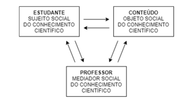
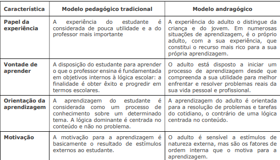
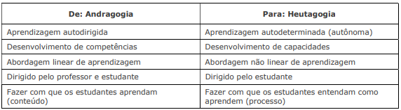
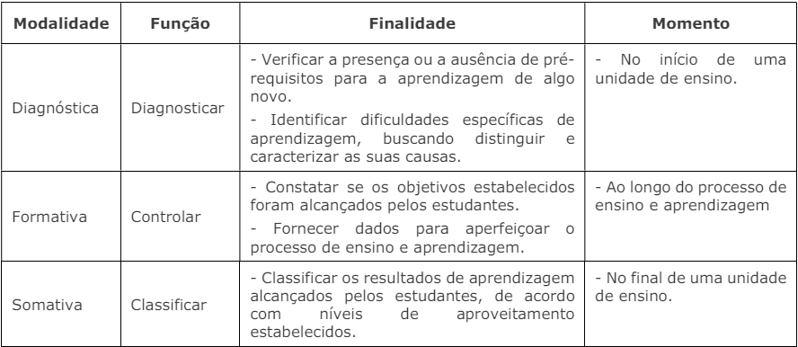

# Ambiente de ensino e aprendizagem a distância

## Livros recomendados

1. BACICH, L; NETO, A. T.; TREVISANI, F. M. Ensino Híbrido: Personalização e Tecnologia na Educação. Porto Alegre: Penso Editora, 2015.

2. BELLONI, M. L. Educação A Distância. 7. ed. Campinas: Autores Associados, 2015.

3. GONZALES, M. Fundamentos da tutoria em Educação a Distância. 2. ed. Campinas: Avercamp, 2015.

4. MOORE, M.; KEARSLEY, G. Educação a distância: Sistemas de aprendizagem on-line. São Paulo: Cengage Learning, 2013.

5. SALES, M. V. S. Tecnologias e educação a distância: os desafios para formação. Salvador: Eduneb, 2018.

* CERIGATTO, Mariana Pícaro; MACHADO, Viviane Guidotti; OLIVEIRA, Édison Trombeta de; Rodrigues, Michele. Introdução à educação a distância. Porto Alegre: Sagah, 2018. E-book. ISBN 9788595026209.

* MACHADO, Dinamara Pereira; MORAES, Márcio Gilberto de Souza. Educação a Distância: Fundamentos, Tecnologias, Estrutura e Processo de Ensino e Aprendizagem. São Paulo: Érica, 2015. E-book. ISBN 9788536522210.

* MATTAR, João. Tutoria e Interação em Educação à Distância. São Paulo: Cengage Learning, 2012. E-book. ISBN 9788522112630.

* VALERIANO, Luciana Aparecida. Planejamento e administração em educação a distância. São Paulo: Cengage Learning, 2016. E-book. ISBN 9788522123865.

## Mediação pedagógica

Com a disponibilidade de novas Tecnologias da Informação e Comunicação
(TICs), as pessoas modificaram a maneira de se relacionar em sociedade e
no trabalho, bem como a maneira de se comunicar, aprender e adquirir
informação e conhecimento. Nesse sentido, a internet e as tecnologias
digitais têm proporcionado possibilidades e desafios para as instituições de
ensino.

Por meio da internet, os estudantes têm acesso rápido a conteúdo que
anteriormente somente poderia ser obtido com o auxílio do professor. Nesse
sentido, perde valor a tradição do professor abordar o conteúdo esperando
que o estudante se comporte passivamente, apenas como ouvinte e
memorizador de informações. Portanto, as aulas tradicionais, com base na
transmissão de conteúdo, devem ser substituídas por atividades que ajudem
o estudante a construir o conhecimento a partir da interação com os colegas,
com o professor e com o próprio conteúdo.

A mediação pedagógica é a atitude e o comportamento do professor ao
apresentar e tratar um conteúdo (assunto ou tema) que auxiliam o estudante
a compreender e lidar com as informações até produzir conhecimento e
mesmo interferir em sua realidade.

A mediação pedagógica requer um mediador (professor) que promova
práticas pedagógicas que contribuam para a aprendizagem do mediado
(estudante). O processo de mediação é realizado por meio do diálogo, do
estímulo, da orientação, e da realização de atividades que envolvam
interação, problematização, pesquisa, tomada de decisão e resolução de
problemas.

Na mediação pedagógica, o professor possibilita aos estudantes o contato
com o objeto de conhecimento, ajudando-os a adquirir o conhecimento
científico a partir de provocações, perguntas sugestivas, diálogo, interação,
colaboração e troca de experiências que impliquem a reconstrução de
conceitos. Possivelmente, o conteúdo (objeto de conhecimento) está
disponível na internet, mas somente será realmente compreendido se o
estudante interagir com as suas diversas formas ou representações,
principalmente por meio de relações interpessoais, isto é, por meio de
diálogos sobre o conteúdo com o seu professor, colegas e com outras
pessoas.

O papel do professor na mediação pedagógica não é o de saber tudo o que
existe sobre um assunto antes do estudante, mas estar aberto para aprender
também com as novas informações descobertas pelo estudante. Além disso,
o seu papel também é estar em condições de discutir e debater as
informações com o estudante, bem como ajudá-lo a desenvolver sua
criticidade diante do que venha a encontrar. Assim, o professor não deverá
considerar incomum se, por acaso, o estudante chegar a dados ou
informações que o próprio professor ainda não tenha conhecimento.

O esquema a seguir representa muito bem o cenário que envolve a mediação
pedagógica. No processo de mediação mostrado nesse esquema, destaca-se
a interação social entre estudante, conteúdo e professor

O psicólogo Vygotsky defendia a ideia de que os indivíduos compreendem a
sua realidade humana e social e nela passam a interferir a partir das relações
que estabelecem com o meio e com as pessoas. Desse modo, percebe-se que
a aprendizagem significativa (na teoria vygotskyana) exigirá uma postura
bastante ativa tanto por parte do professor (mediador) quanto do estudante
(mediado). 

## As Tecnologias no Ensino Presencial e On-Line

Tradicionalmente, as aulas são expositivas, pois acredita-se que essa seja
uma forma eficiente de ensino. No entanto, com o avanço das tecnologias e
a consequente facilidade de acesso à informação, a sala de aula e a biblioteca
das instituições de ensino não são mais a única fonte de conhecimento
disponível para os alunos. Por meio do desenvolvimento dos computadores,
smartphones, tablets e internet, pode-se aprender em qualquer lugar a
qualquer hora. Contudo, o papel da instituição de ensino não termina, mas
se expande, e é sua responsabilidade direcionar e capacitar os alunos a
explorar de forma responsável os novos caminhos para o conhecimento.

Uma das formas de alcançar esse objetivo é a instituição reconhecer que o
uso da tecnologia potencializa a ação de todos os sujeitos envolvidos no
processo ensino e aprendizagem. As ferramentas tecnológicas possibilitam a
personalização da aprendizagem e fornecem estímulos que impulsionam os
estudantes em suas descobertas.

Utilizando as tecnologias, os professores podem potencializar suas aulas com
tarefas diferentes e alcançar os alunos de uma forma que a metodologia
tradicional, com suas aulas expositivas e o conhecimento centrado no docente
não permitia. Dessa forma, o professor não é mais um transmissor do
conteúdo, mas um orientador, mediador ou facilitador na construção do
conhecimento, isto é, é quem auxiliará os alunos a aprender.

Os estudantes podem se sentir mais estimulados ao perceber sua progressão
constante e sua autonomia sendo alcançada a cada atividade. Podem ser
desafiados a encontrar soluções para os mais diversos problemas, a trabalhar
em grupo, respeitando a individualidade e a capacidade de seus colegas, o
que os preparará para viver em um mundo mais dinâmico e complexo. 

## PAPEL DA TECNOLOGIA

A tecnologia não é um instrumento, que foi o termo adotado na época da
industrialização e que se refere a um utensílio utilizado no trabalho fabril. A
tecnologia pode ser considerada uma interface, que é um novo termo criado
na informática e ao qual a interação e multiplicidade são inerentes. Nesse
sentido, no ensino percebe-se uma transição da transmissão unilateral das
informações para um processo moldado pela interatividade, participação,
intervenção e bidirecionalidade.

Tradicionalmente, as instituições de ensino foram formadas tendo o professor
como especialista e fonte de conhecimento. Assim, esperava-se que esse
profissional fornecesse aos estudantes todas as habilidades necessárias para
viverem o resto de suas vidas. No entanto, o volume de informações tem
crescido de modo exponencial, tornando essa tarefa inviável há muitos anos.
Em contraste, agora é possível obter informações de vídeos, da internet e de
programas (software).

Uma das características da instituição de ensino tradicional é a crença de que
não se pode usar livros, calculadoras e muito menos o computador quando
se realiza um teste. No entanto, na vida adulta, um profissional tem mais
sucesso se souber mobilizar recursos, muitas vezes com o apoio de
tecnologia, para a realização eficiente de tarefas.

Em última análise, a tecnologia não veio para substituir a sala de aula
tradicional, mas para garantir que novos recursos sejam utilizados com
eficácia por meio de uma integração dos aprendizados presencial e on-line. 

## ALGUNS TIPOS DE RECURSOS ON-LINE

O número de interfaces de ensino e aprendizagem e de seus usuários tem
crescido exponencialmente. Os objetivos de cada interface são diversificados,
e um mesmo professor pode usar com regularidade mais de uma para
potencializar seus métodos de ensino.

Observação: A utilização de qualquer recurso no ensino deve ter,
impreterivelmente, um foco educacional e sempre atender a um objetivo de
aprendizagem bem definido.

A finalidade de se usar uma ferramenta tecnológica não pode ser o uso per
se (em si mesmo). É necessário que o professor, ao propor a utilização de
algum desses recursos, pense nos benefícios e nos requisitos que serão
atendidos, nas facilidades que serão proporcionadas, se dados serão
produzidos (e, em caso afirmativo, de quais tipos de dados) e nos pontos que
serão insuficientes. Nesse sentido, é preciso conhecer os recursos
previamente para fazer essa análise.

A seguir, são apresentadas algumas ferramentas que podem ser usadas pelos
professores, fazendo uma classificação de acordo com as características
específicas de cada uma. 

### Ambiente virtual de aprendizagem 

Um Ambiente Virtual de Aprendizagem (AVA) é um espaço on-line construído
para proporcionar interações entre os usuários. Essas interações podem ser
variadas, síncronas (ao mesmo tempo) ou assíncronas (em tempos
diferentes), de um-para-todos (uma mensagem compartilhada com todos
que estão no ambiente), de um-para-um (uma mensagem privada enviada a
uma pessoa específica) ou de todos-para-todos (mensagens que podem ser
enviadas e visualizadas por todos). Dessa forma, existe semelhanças com a
sala de aula presencial.

A possibilidade de interações ocorrerem de todos-para-todos é o que
caracteriza um AVA. Nesse sentido, existe uma troca entre o papel dos
participantes dessas interações: ora são emissores, ora são receptores de
mensagens. Portanto, os participantes têm um papel reflexivo sempre ativo,
mesmo quando recebem mensagens. A construção do conhecimento, assim,
pode ser realizada colaborativamente.

Em um AVA, é possível disponibilizar materiais variados, como vídeos, textos,
planilhas, questionários, fóruns, avaliações, entre outros. Em algumas
interfaces, o layout pode ser personalizado para a disciplina em questão.

Existem interfaces que auxiliam na organização de notas, tarefas, trabalhos,
mensagens e fóruns, como o Moodle (http://moodle.com) e o Edmodo
(http://edmodo.com). Nesses ambientes, os alunos podem ter acesso a
materiais e mídias disponibilizados pelos professores, participar de avaliações
por meio de tarefas, questionários e testes on-line, bem como contribuir para
a construção conjunta de conhecimento nos fóruns mediados pelos
professores ou tutores.

O Moodle, por exemplo, é um sistema de gerenciamento de cursos gratuito,
compatível com diferentes sistemas operacionais e de fonte aberta (pode ser
utilizado, instalado e modificado livremente pelo usuário). Uma das
vantagens desse AVA é a facilidade de publicar arquivos externos e de
integrá-lo com outras ferramentas, como o YouTube. 

### Plataformas adaptativas

Com o advento das ferramentas com foco em interatividade, surgiram as
plataformas adaptativas, que são sistemas especialmente desenvolvidos para
analisar o comportamento de seus usuários e propor atividades
personalizadas, um salto importante para a personalização do ensino.

Nas plataformas adaptativas, os estudantes têm acesso a diversas
experiências de aprendizagem, como vídeos, textos, dicas, exercícios e jogos.
Além disso, professores e alunos podem receber em tempo real relatórios de
desempenho.

Alguns exemplos de plataformas adaptativas são a Khan Academy
(http://pt.khanacademy.org), a Mangahigh (www.mangahigh.com/pt-br), a
Geekie (www.geekiegames.com.br), disponíveis em português, e a
SmartSparrow (www.smartsparrow.com).

A Khan Academy é uma plataforma adaptativa gratuita e bastante utilizada
em escolas públicas e particulares. Videoaulas e dicas de resolução de
exercícios acompanham todos os conteúdos. Os professores podem organizar
seus alunos em classes virtuais e analisar o desempenho geral e individual,
facilitando intervenções específicas. Existe um sistema de pontuação e
medalhas que motiva a participação dos alunos e promove a competição.

Com base em seu sucesso nos desafios diários que a plataforma disponibiliza,
os estudantes podem atestar o domínio de um conteúdo, promovendo, assim,
seu avanço para um conteúdo mais complexo.

A Mangahigh é uma plataforma inteligente de matemática baseada em jogos
(games) e testes (quizzes). Por meio dessa plataforma, também é possível
diagnosticar em tempo real os alunos. A plataforma apresenta diversos
desafios que abrangem desde o ensino fundamental até o médio. O professor
pode atribuir tarefas aos seus alunos e fazer o download dos resultados para
avaliar seu progresso. Existem atividades baseadas na resolução de
problemas com diferentes ordens de complexidade, todas apoiadas por dicas
específicas.

A Geekie é uma plataforma brasileira que ajuda os estudantes a se preparar
para o Exame Nacional do Ensino Médio (ENEM). A plataforma abrange todo
o conteúdo do exame, isto é, ciências da natureza, humanas, linguagens e
matemática. A partir de um teste inicial, a plataforma faz um diagnóstico para
conhecer o perfil e mapear alguns conhecimentos do aluno, e com isso, um
plano de estudos é traçado. Existem videoaulas, textos e exercícios que se
adaptam à melhor forma de aprender para cada estudante. Além disso,
professores e gestores podem acompanhar o desempenho dos estudantes e
das classes.

A SmartSparrow é uma plataforma que permite a criação de cursos
interativos e adaptativos. O docente pode inserir conteúdo multimídia de
diferentes graus de complexidade e criar testes que realizam o diagnóstico
constante dos alunos, direcionando-os para as atividades seguintes de acordo
com o seu desempenho.

### Google e complementos

O Google também tem investido na criação de ferramentas voltadas à
educação. Recentemente, criou o Google for Education, centrado em três
soluções principais: Google Apps for Education, que apresenta os mesmos
recursos do Google Apps for Business (formulários, planilhas, arquivos de
texto, entre outros), mas voltados para o uso nas instituições de ensino; o
Chromebook for Education, que é um notebook integrado aos serviços do
Google Apps for Education; e o Google Play for Education, que consiste em
aplicativos específicos para tablets para uso em sala de aula.

O YouTubeEdu (www.youtube.com/edu) disponibiliza videoaulas de todas as
disciplinas acadêmicas, desde o ensino fundamental ao superior. Todos os
vídeos foram selecionados a partir de uma rigorosa equipe de curadoria para
garantir a qualidade do conteúdo. Os professores podem utilizar esses vídeos
para destacar alguns tópicos, alcançando alunos que aprendem melhor com
recursos visuais. Um software muito interessante que pode ser utilizado em
conjunto com esses vídeos é o Zaption (www.zaption.com), o qual permite a
introdução de testes (quizzes) em diversos pontos das mídias, mantendo a
atenção dos alunos e avaliando-os segundo aquilo que assistiram.

O Google Drive (https://drive.google.com) permite criar documentos que
podem ser elaborados e editados de forma colaborativa e simultânea,
promovendo a criação democrática do conhecimento. Os professores também
podem criar e disponibilizar formulários on-line para tarefas e avaliações
contendo figuras e links, e cujas respostas podem ser em forma de texto,
múltipla escolha ou preenchimento de lacunas. Existem diversos
complementos que podem ser instalados, como o Flubaroo
(www.flubaroo.com), que corrige as respostas automaticamente seguindo
um gabarito previamente elaborado, facilitando o trabalho do professor.

### Objetos de aprendizagem 

Os objetos de aprendizagem podem ser definidos como recursos digitais que
podem ser usados, reutilizados e combinados com outros objetos para formar
um ambiente de aprendizado rico e flexível. Os repositórios de objetos de
objetos de aprendizagem são semelhantes a uma biblioteca virtual desses
recursos. Esses repositórios são preparados por professores e pesquisadores
e envolvem mídias diversificadas, como jogos, vídeos, músicas e programas.

São exemplos de repositórios, o Banco Internacional de Objetos Educacionais
(http://objetoseducacionais.mec.gov.br) e o RIVED (http://www.dmm.im.
ufrj.br/projeto/rived/), organizados pelo MEC. Nesses repositórios, é possível
buscar conteúdo para todos os níveis de ensino e classificá-los também pela
qualidade e relevância. Outros exemplos são a Escola Digital
(http://escoladigital.org.br), o Portal do Professor (http://portaldoprofessor.
mec.gov.br), a Educopédia (www.educopedia.com.br), o Domínio Público
(www.dominiopublico.gov.br), o Laboratório Didático Virtual
(www.labvirt.fe.usp.br) e o Currículo+ (http://curriculomais.educacao.sp.
gov.br). 

## ORIENTAÇÕES DE COMO ESTUDAR A DISTÂNCIA: APRENDER A APRENDER

Estudar é uma ação intencional na qual uma pessoa se dispõe a aprender um
determinado conhecimento ou desenvolver algum tipo de habilidade. Nem sempre o ato
de estudar resulta em uma aprendizagem. Para que a aprendizagem se concretize, a
ação de estudar deve ser conduzida por estratégias e atitudes adequadas ao contexto
no qual o estudante está inserido.

Quando o estudante conhece as estratégias para estudar e adota uma postura adequada
diante do processo de estudo de um determinado conteúdo, seja qual for, então podese dizer que ele aprendeu a aprender. Portanto, aprender a aprender é uma atitude
diante das especificidades dos procedimentos necessários ao aprendizado de qualquer
conteúdo.

Dessa forma, para que o estudante obtenha sucesso nos estudos de um curso na
modalidade de Educação a Distância (EaD), é fundamental que conheça as estratégias
de como aprender a distância. A seguir, algumas dicas de estratégias de como aprender
a distância são apresentadas.

## REGRAS DO CURSO E DO AMBIENTE VIRTUAL

Procure conhecer sobre as regras de realização do curso e sobre o ambiente virtual.
Antes de iniciar o estudo do conteúdo do curso, é muito importante que o estudante
esteja a par das informações sobre o curso e conheça as ferramentas de navegação que
o ambiente virtual oferece. Portanto, procure ler todas as orientações disponibilizadas e
navegue pelo ambiente virtual para aproveitar todos os recursos que podem auxiliar na
aprendizagem. 

## TEMPO E PLANEJAMENTO DE ESTUDOS

Administre o tempo por meio do planejamento dos estudos.
Procure não acumular as atividades reservando um tempo durante o dia ou durante a
semana (dependendo da duração do curso) para se dedicar ao estudo do conteúdo do
curso. Tente acessar com frequência o ambiente virtual e fazer uma leitura, mesmo que
seja por um período curto. Essa prática ajuda a desenvolver o hábito a disciplina de
estudo. Empenhe-se para cumprir o cronograma sugerido. 

## MÉTODOS E TÉCNICAS DE ESTUDOS

Utilize métodos e técnicas de estudos.
Pesquise sobre as diversas técnicas de estudo e utilize aquelas com as quais tiver mais
afinidade. Dentre as técnicas de estudos, sugere-se as seguintes: mapas mentais,
esquemas de anotações e resumos.
Em todos os cursos, o estudante depara-se com conteúdo no qual tem mais facilidade e
com conteúdo que tem mais dificuldade. Não desista diante das primeiras adversidades,
mas desenvolva suas estratégias de aprendizagem e recorra quando necessário à equipe
pedagógica do curso. 

## INTERAÇÃO COM OS PARTICIPANTES

Procure interagir com os demais participantes do curso.
Algumas atividades do curso podem requerer um mínimo de interação. Participe dessas
atividades propostas, pois são necessárias para que o estudante desenvolva melhor a
compreensão sobre o assunto e alcance os objetivos de aprendizagem. Compartilhe
ideias, textos, conhecimentos, dúvidas e sugestões, contribuindo para a criação de um
ambiente de colaboração e construção coletiva de conhecimentos. 

## AJUDA NECESSÁRIA 

Peça ajuda quando precisar.
É muito importante que o estudante se comunique com o Coordenador quando surgirem
dúvidas e/ou dificuldades relacionadas aos aspectos pedagógicos e administrativos. Se
as dúvidas forem relacionadas ao conteúdo do curso, procure comunicar-se com o tutor
ou professor. As interações devem ser feitas utilizando preferencialmente as ferramentas
de comunicação do ambiente virtual. 

## MOTIVAÇÃO DE ESTUDO 

Procure motivar-se nos estudos.
A motivação é uma vontade interior que impulsiona as ações das pessoas. Assim, busque
sempre encontrar os aspectos positivos e interessantes no conteúdo. Tente relacionar o
conteúdo com situações reais vivenciadas e com a aplicação na vida profissional e/ou
pessoal.

## PERSISTÊNCIA E DISCIPLINA

Seja persistente e disciplinado.
No decorrer do curso, é possível deparar-se com conteúdo complexo, com situações
novas, ou até mesmo podem surgir dificuldades pessoais que causam desânimo e
vontade de desistir. A persistência é a chave para que o estudante ultrapasse as
limitações e desenvolva novas habilidades que talvez nem saiba que seja capaz de
alcançar. Reorganize o tempo, estabeleça um novo plano de estudo, compartilhe as
dúvidas e dificuldades, troque informações. 

## Materiais Complementares

RIGO, R. M. Mediação pedagógica em ambientes virtuais de aprendizagem. In: REUNIÃO CIENTÍFICA REGIONAL SUL DA ASSOCIAÇÃO NACIONAL DE PESQUISA E PÓS-GRADUAÇÃO EM EDUCAÇÃO, 10., 2014, Florianópolis. Anais [...]. Florianópolis: UDESC, 2014. p. 1-16. Disponível em [https://repositorio.pucrs.br/dspace/bitstream/10923/7083/1/000466402-Texto%2bCompleto-0.pdf]

notion para iniciantes: [https://www.youtube.com/watch?v=rYBxZPRs6wc]

# Aula 2
## CONCEITO DE MODELO
A atividade científica procura compreender, explicar e predizer fenômenos do mundo. Por esse motivo, a ciência busca generalizar e simplificar a realidade por meio de leis, princípios e modelos. Nesse sentido, o conceito de modelo tem o direcionamento de estabelecer uma relação por analogia com a realidade.

O conceito de modelo é um dos conceitos mais importantes que fundamentam
a atividade científica. Um modelo é uma representação compartilhada de um
conjunto de relações que definem um fenômeno com objetivo de melhor
compreendê-lo. Em outras palavras, um modelo é um sistema figurativo que
reproduz a realidade de maneira mais abstrata, quase esquemática e que
serve de referência.

Um modelo de ensino é o modo ou forma de ensino que exerce e sofre
influência de vários fatores e mecanismos que fazem parte do processo de
aprendizagem e da estrutura e organização de um curso. Esses fatores
implicam o planejamento, os métodos e as técnicas de ensino, as formas e
técnicas de avaliação, as formas de interação e, consequentemente, a
construção do conhecimento durante o processo de ensino-aprendizagem.

No ensino a distância, os modelos devem ser vistos como possibilidades em
uma prática que valoriza a atividade e a ação reflexiva em todas as etapas
do processo de ensino-aprendizagem, e não como os únicos caminhos a
serem seguidos.

**Texto adaptado de:**

BEHAR, P. A.; PASSERINO, L.; BERNARDI, M. Modelos pedagógicos para
educação a distância: pressupostos teóricos para a construção de objetos de
aprendizagem. Novas Tecnologias na Educação, v. 5, n. 2, 2007.

CARVALHO JÚNIOR, A. F. P. Educação a distância: uma análise dos modelos
de ensino. EaD em Foco, v. 3, n. 1, p. 46-54, 2013. 

## Modelos de EAD

* O termo ensido a distância refere-se a vários modelos de ensino que tem em comum a separação física entre o professor e o aluno

* Todos os modelos de ead dão construídos em torno dos seguintes componentes:
    * Apresentação de conteúdo
    * interação com o professor, com os colegas e com recursos educacionais
    * aplicação prática
    * avaliação
* cada modelo de ead utiliza a tecnolocai de maneiras diferentes para tratar cada um dos componentes citados anteriormente
* os modelos de ead também são diferentes com relação ao controle
    * professor
    * estudante
* Modelos:
    * modelo1  - sala de aula distribuída
    * modelo2 - estudo independente
    * modelo3 - estudo independente com aulas
### Sala de aula distribuída
* tecnologia de comunicação permite agregar uma ou mais salas remotas á sala de aula convencional (modelo híbrido)
* característica principal
    * professor e alunos devem estar em um determinado local ao mesmo tempo (comunicação síncrona)
* características:
    * professor e alunos devem estar em um determinado local ao mesmo tempo( comunicação sincrona)
    * alunos podem escolher uma sala proxima a sua residencia ou trabalho ( ou participar da sua própria residencia)
    * pode haver um número variável de alunos por sala
    * a experiencia (professor e alunos) é semelhante que a a da sala de aula tradicional
    * o problema é estimular a participacao ativa
    * o papel do professor não se altera muito em relação à aula tradicional, mas o uso de tecnologia requer alguma adaptação na maneira de fazer uma apresentação
    * os alunos presenciais se mostram menos tolerantes a problemas técnicos
    * dificuldade de interação entre alunos presenciais e alunos remotos.
    * o aluno remoto tende a se sentir isolado e excluído da turma presencial, a não ser que o professor faça um esforço planejado de inclusão
    * tecnologias para a poisar o modelo: videoconferencia, gerenciadores de conteúdo, aplicativos de mensagens instantaneas, mensagens eletronicas, recursos web e materiais on-line
    * necessário o apoio de tutores.

### Estudo independente
* o aluno recebe o material do curso e tem acesso a um professor que orienta o estudo, reponde a perguntas e realiza a avaliação
* o aluno não tem a obrigatoriedade de estar em um determinado local o mesmo tempo
* característica principal
    * alunos estudam de forma independente, não existem aulas formais
* características
    * alunos estudam de forma independente, seguindo as orientações contidas no material do curso
    * os alunos são avaliados pelo conhecimento e competencias que foram apropriados
    * os alunos devem ter alta capacidade de se organizar e devem ser acompanhados individualmente por tutores
    * o material do curso pode ser fornecido no formato impresso, paginas web documentos para sownload e vídeos, que podem ser utilizados em qualquer momento e em qualquer lugar
    * o material utilizado ao longo de varios anos e geralmente é resultado de um desenvolvimento que envolve especialistas
    * necessário ter uma boa infraestrutura (recursos materiais e humanos)
    * os alunos precisam de tutores capacitados
    * alunos podem interagir com o professor e, eventualmente, com outros alunos por meio de tecnologia
    * o professor estrutura e facilita a experiência de aprendizagem, mas divide o controle do andamento do curso com o aluno
    * o aluno pde organizar a sua agenda, mas deve ter responsabilidade, comprometimento e motivação para seguir as atividades do curso.

### Estudo independente com aulas
* combinação do uso do material do curso e do uso ocasional de tecnologia de comunicação
* característica principal
    * alunos estudam no seu próprio ritmo e ocasionalmente se encontram em uma aula (física ou virtual) para apresentar o conhecimento apropriado e interagir com o professor e os demais alunos
* características
    * os alunos ocasionamente se reúnem em uma aula, geralmente por videoconferência
    * as reuniões servem para discutir e esclarecer conceitos, resolver problemas ou desenvolver projetos
    * o professor estrutura e facilita a experiência da aprendizagem, mas cede algum controle do curso para o aluno
    * o aluno tem mais flexibilidade na sua agenda devido ao número menor de aulas
    * as aulas periódicas auxiliam o aluno a estruturar o seu estudo, mas ainda é necessário ter disciplina e maturidade
    * tecnologias para apoiar o modelo são semelhantes às do modelo sala de aula distribuída

### considerações finais

* apresentar as alteranativas existentes pra o ensino a distãncia, vantagens e problemas
* qual o modelo de ensino a distãncia que deve ser utilizado.

## Atividade 2 

* Escolha um curso de ensino a distância de uma instituição de ensino e apresente uma análise com relação ao:

* Modelo de ensino a distância adotado (pelo curso);

* Uso da tecnologia para a interação (entre os participantes);

* Controle do curso (pelo estudante).

* A análise deve incluir uma breve descrição prévia do curso escolhido (por exemplo, nome do curso, objetivo do curso e instituição de ensino responsável pelo curso).

* **Resposta**
    * Instutuição de ensino: MBA USP ESALQ
    * Curso: MBA em Data science e Analytics
    * Objetivos do curso:
        * O objetivo do nosso MBA é capacitar o profissional no desenvolvimento de técnicas de ciência e análise de dados, balanceando fundamentos, programação e tomada de decisão, por meio da explicitação das principais técnicas de Data Science, Machine Learning e Analytics, com foco na geração de informação voltada ao estabelecimento de estratégias para tomada de decisão, adaptação, no conhecimento de tecnologias emergentes e na alocação de recursos.
    * Modelo de ensino a distância adotado: 
        * Sala de aula distribuída.
        * Os professores ministram aulas semanais sincronas.
        * após a aula existe uma prova que fica aberta por até três meses, para o aluno a gravação e materiais ficam disponíveis até o fim do curso.
        * As aulas são sincronas no formato remoto apenas.
        * Existem tutores para tirar dúvidas.
    * Uso da tecnologia para interação:
        * Através de um sistema chamado move: O Sistema Acadêmico Move foi desenvolvido para garantir a melhor experiência no seu aprendizado. É nele que o aluno realiza seus estudos e provas, tira quaisquer dúvidas e interage, dentro e fora das aulas, com outros alunos e professores.
    * Controle do curso (pelo estudante)
        * o estudante segue a agenda estipulada no cronograma e as regras do programa.
        
# Aula 3

* Orientações
* educação a distância
* dois textos
    * evolução da educação a distância
    * conceitos e componentes de educação a distância

## EVOLUÇÃO DA EDUCAÇÃO A DISTÂNCIA

A Educação a Distância (EAD) não é novidade, mas é considerada um dos avanços mais revolucionários da história da Educação. A sua origem pode estar nas cartas de Platão e nas epístolas de São Paulo. Existem registros e experiências de educação por correspondência iniciados no final do século XV, XVIII, e com largo desenvolvimento em meados do século XIX. 

Na 2ª Guerra Mundial, os Estados Unidos utilizavam essa modalidade para treinar os soldados. No Brasil, o Instituto Monitor e o Instituto Universal Brasileiro foram instituições que inovaram a oferta de cursos de ensino profissionalizante, atuando no cenário brasileiro desde o final do século XX. 

Durante mais de 200 anos, a expressão “Educação a Distância” foi empregada para designar formas variadas de ensino e aprendizagem, nas quais os estudantes não estivessem em contato direto com os seus instrutores: cursos por correspondência, cursos pelo rádio ou televisão e cursos baseados em fitas magnéticas ou fitas de vídeo.

Recentemente, a internet provocou uma grande revolução na Educação a Distância, uma vez que possibilita perspectivas inéditas para essa modalidade de ensino, contribui para romper as barreiras do tempo e da distância e permite mais flexibilidade para disponibilizar e democratizar o conhecimento. 

Desde a sua origem até os dias atuais, a evolução da Educação a Distância pode ser dividida em quatro gerações, de acordo com as diferentes tecnologias utilizadas para produção, distribuição e comunicação: 

* 1ª Geração – até 1970 – Ensino por correspondência. Essa geração tem como característica a produção de material impresso e distribuição por correspondência utilizando o serviço postal. A comunicação é assíncrona e centrada na troca de documentos escritos entre professor e estudante, normalmente a partir da iniciativa do professor e a interação entre estudantes é inexistente. 

* 2ª Geração – de 1970 a 1985 – Ensino por teleducação. Essa geração tem como característica a transmissão por rádio, televisão, fitas de áudio e/ou vídeo, além da manutenção do material impresso. A troca de documentos por correspondência é mantida, mas a utilização do telefone permite a comunicação síncrona entre professor e estudante. No entanto, a interação entre estudantes continua inexistente.

* 3ª Geração – de 1985 a 1995 – Ensino por multimídia. Caracterizada pela utilização de multimídia interativa e pela distribuição realizada por meio de mídia magnética utilizando o serviço postal. O uso de programas de aprendizado assistido por computador permite ao estudante obter algum feedback com relação à atividade de aprendizagem. A comunicação com o professor pode ocorrer de forma síncrona utilizando o telefone, ou assíncrona utilizando o correio eletrônico. A interação entre estudantes pode ser realizada individualmente, por meio de correio eletrônico, ou em grupos, por meio de fórum de discussão. No entanto, a interação entre estudantes não é um elemento essencial para o desenvolvimento de atividades de ensino e aprendizagem.

* 4ª Geração – a partir de 1995 – Ensino e aprendizagem em rede. Essa geração é caracterizada pela utilização crescente de tecnologias digitais para a produção e distribuição de conteúdo. Além disso, os ambientes e ferramentas web permitem um modelo de construção coletiva e colaborativa de conhecimento. A comunicação é direta e frequente entre todos os intervenientes, professores e estudantes, e realizada por meio de diversos serviços em rede (internet), como mensagens instantâneas e videoconferência. A interação entre estudantes é efetiva e significativa. Nesse sentido, surgem novas perspectivas em termos de desenvolvimento de situações de aprendizagem em grupo, entre pares e de natureza colaborativa, permitindo a formação de comunidades de aprendizagem.

* Além dessas gerações, seria possível identificar uma 5ª Geração, derivada diretamente da anterior, mas com a utilização de ambientes ou plataformas avançadas com potencial para oferecer experiências de aprendizagem personalizadas. De qualquer modo, é fundamental compreender que as gerações sinalizam a utilização de diferentes tecnologias para produção, distribuição e comunicação no âmbito da Educação a Distância, mas não significa que uma geração tenha sido totalmente suplantada pela seguinte e que não mais exista.

### Texto adaptado de:
GOMES, M. J. Gerações de inovação tecnológica no ensino a distância. Revista Portuguesa de Educação, v. 16, n. 1, p. 137-156, 2003.

MOORE, M. G.; KEARSLEY, G. Distance education: a systems view of online learning. 3. ed. Wadsworth: Cengage Learning, 2011. 

## CONCEITOS DE EDUCAÇÃO A DISTÂNCIA:

A Educação a Distância (EAD) é um tema que recebe cada vez mais atenção, muito em razão de seu crescimento e de suas potencialidades. Nesse sentido, pode-se encontrar muitas definições diferentes para esse termo. Pimentel (2006) destaca diversas definições encontradas na literatura e afirma que são muitas as variáveis que contribuíram para diversificar o que se entende por Educação a Distância.

Partindo da análise de outras definições, Keegan (1980) indica seis características que considera essenciais em qualquer definição de Educação a Distância que pretenda ser abrangente:
1. A separação entre o professor e estudante, que a distingue da
educação presencial;
2. A influência de uma organização educacional, que a distingue do estudo individual;
3. O uso de mídia técnica, geralmente impressa, para unir professor e estudante e entregar conteúdo educacional;
4. A provisão de comunicação bidirecional, para que o estudante possa se beneficiar ou mesmo iniciar o diálogo;
5. A possibilidade de encontro ocasional para fins didáticos e de
socialização;
6. A participação em uma forma industrializada de educação que, se aceita, contém o cerne da separação radical da educação a distância de outras formas de educação.

Essa proposta tem sido extensivamente referenciada na literatura e recebido diversas análises e críticas. A inclusão de referência à característica industrial da Educação a Distância talvez tenha sido a principal questão, pois reduz a abrangência do conceito ao excluir outras possibilidades. Na reformulação de sua caracterização, Keegan (1996) elimina a referência à Educação a Distância com uma forma industrializada de educação.

Moore e Kearsley (1996, 2010) definem Educação a Distância como o
aprendizado planejado que ocorre normalmente em um lugar diferente do local de ensino e que exige técnicas especiais de criação do curso e de instrução, comunicação por meio de várias tecnologias e disposições organizacionais e administrativas especiais. Segundo Moore e Kearsley (1996), as cinco características a seguir são essenciais para definir a Educação a Distância: 
1. A separação física e geográfica entre estudante e professor;
2. O planejamento e preparação de materiais de aprendizado por uma organização educacional;
3. No processo de ensino e aprendizagem, o apoio que viabiliza e
incentiva a autonomia dos estudantes é importante para encorajar a interação e contribuir para a aprendizagem;
4. O aprendizado planejado;
5. A comunicação por meio de tecnologias e mídias diversas.

Para Moran (2002), a Educação a Distância é o processo de ensino e aprendizagem mediado por tecnologias, no qual os professores e estudantes estão separados de maneira espacial e/ou temporal. O ensino e a aprendizagem ocorrem quando professores e estudantes não estão juntos fisicamente, mas podem estar conectados e interligados por tecnologias, principalmente os serviços de comunicação e informática, como a internet. Na expressão “ensino a distância”, a ênfase é dada ao papel do professor, como alguém que ensina a distância. Segundo Moran (2002), existe a preferência pela palavra “educação” (no termo Educação a Distância) porque é mais abrangente, embora nenhuma das expressões seja perfeitamente adequada.

Na legislação brasileira também é possível encontrar referências para a Educação a Distância, em especial a partir da aprovação da Lei de Diretrizes e Bases da Educação Nacional (LDB), em 1996. A Educação a Distância é considerada como a modalidade educacional na qual a mediação didático-pedagógica no processo de ensino e aprendizagem ocorra com a utilização de meios e tecnologias de informação e comunicação, com pessoal qualificado,
com políticas de acesso, com acompanhamento e avaliação compatíveis, entre outros, e desenvolva atividades educativas por estudantes e profissionais da educação que estejam em lugares e tempos diversos (BRASIL, 2017).

Apesar da possibilidade de existir muitas outras definições além das apresentadas neste texto, todas têm algo em comum com relação aos seguintes aspectos (GOMES, 2009): a distância física entre professor e estudante; a forma de estudo; e a utilização de tecnologias para promover a interação. Em última análise, essa diversidade de definições, conceitos e entendimentos com relação à Educação a Distância é uma indicação de que o assunto está em permanente evolução.

## COMPONENTES DA EDUCAÇÃO A DISTÂNCIA 

Um sistema de educação a distância pode ser comparado a uma “instituição de ensino virtual”, pois apresenta muitos componentes equivalentes aos de uma instituição de ensino convencional. Apesar de não possuir necessariamente salas de aulas físicas, um sistema de educação a distância não dispensa a maioria dos recursos humanos tradicionais. 

O termo “sala de aula virtual” é muito utilizado para fazer referência a um ambiente digital ao qual os estudantes podem ter acesso por meio da internet a conteúdo e tecnologias de comunicação para promover a aprendizagem, colaboração e interação. Nesse contexto, esse tipo de ambiente também é conhecido como Ambiente Virtual de Aprendizagem (AVA).

Com base em Santos e Rodrigues (1999) e Gomes (2009), os principais componentes de um sistema de educação a distância podem ser os seguintes:
* Estudante;
* Professor;
* Tutor ou monitor;
* Facilitador;
* Suporte técnico e administrativo;
* Administrador ou coordenador;
* Sistema de gerenciamento de aprendizagem.

O estudante é o elemento principal no processo de ensino e aprendizagem. O objetivo do estudante é ter acesso a conhecimento que possa ser útil para a sua vida pessoal e/ou profissional. Para isso, o estudante procura desenvolver e exercitar a sua autonomia, e passa a gerenciar mais intensamente a sua aprendizagem, tornando-se participante ativo na busca pelo conhecimento.

O professor é fundamental para o sucesso da educação a distância. As suas principais responsabilidades são: selecionar o conteúdo do curso; definir as estratégias de ensino e mediação pedagógica; e realizar a avaliação da aprendizagem. Adicionalmente, o professor procura atender às características e necessidades especiais dos estudantes. Além disso, também precisa adaptar seus estilos de ensino, considerando as expectativas de múltiplas, e frequentemente distintas, audiências.

O tutor, também chamado de monitor ou professor-tutor, é um elemento dinâmico e essencial no processo de ensino e aprendizagem, que desempenha a sua função próximo do professor e da gestão acadêmica. As suas principais responsabilidades são: responder dúvidas dos alunos; corrigir exercícios; e interagir com os estudantes quando necessário, provendo retorno rápido. Para isso, o tutor deve obrigatoriamente ter conhecimento sobre o conteúdo do curso. No entanto, definir e criar conteúdo, assim como responder dúvidas complexas e corrigir provas subjetivas, são responsabilidades exclusivas do professor.

O facilitador nem sempre está presente em todos os sistemas de educação a distância. Para exercer essa função não é obrigatoriamente necessário conhecer o conteúdo do curso. As suas principais responsabilidades são: auxiliar o professor; operar equipamentos locais; e aplicar as avaliações presenciais.Um exemplo típico de facilitador é o responsável pelo polo de educação a distância onde acontece um curso.

O suporte abrange todo o pessoal responsável pelos aspectos técnicos e administrativos relacionados com a educação a distância. O pessoal do suporte técnico é responsável por operar e manter equipamentos, configurar sistemas e monitorar canais de comunicação e, em alguns sistemas de educação a distância, também podem existir responsáveis pelo projeto pedagógico e gráfico do material didático. O pessoal do suporte administrativo é responsável por gerenciar matrículas, processar notas e diários, emitir declarações, certificados e diplomas, e organizar documentos, de maneira semelhante à função exercida em uma instituição de ensino convencional. 

O administrador ou coordenador é responsável por gerenciar o sistema de educação a distância com foco na gestão acadêmica. Ao administrador compete decidir sobre equipamentos e recursos de software, definir a política de pessoal, estabelecer prioridades, mediar conflitos entre outras atividades. Nesse sentido, o administrador deve sempre manter um foco acadêmico nas
suas ações.

O material didático é responsável por disponibilizar o conteúdo principal do curso ao estudante e servir de apoio para as atividades. Esse material pode ser concretizado nas mais diversas formas: página web, e-book, documento digital (PDF), imagem, áudio e vídeo, programas educacionais entre outros. O material didático é a referência primária de informação e deve incentivar o estudante a buscar novos conhecimentos de forma independente.

O sistema de gerenciamento de aprendizagem (LMS, do inglês Learning Management System) é formado por diversos módulos responsáveis por uma ou mais das seguintes funções principais: configurar cursos; controlar acesso a cursos; gerenciar inscrições; registrar acessos dos estudantes; editar e disponibilizar material didático; oferecer suporte à comunicação; e elaborar avaliações. Esse sistema também é conhecido por Ambiente Virtual de Aprendizagem (AVA ou VLE, do inglês Virtual Learning Environment). 

Dependendo do sistema de educação a distância, outros componentes podem aparecer com outras denominações e/ou funções, muitas vezes decorrente de alguma demanda pedagógica ou gerencial ou de um desdobramento a partir de um componente existente. Por exemplo, o suporte técnico pode incluir um conteudista, ou professor conteudista, responsável por desenvolver, organizar e definir o conteúdo a ser disponibilizado no curso. 

### REFERÊNCIAS 
BRASIL. Decreto nº 9.057, de 25 de maio de 2017. Regulamenta o art. 80 da Lei nº 9.394, de 20 de dezembro de 1996 , que estabelece as diretrizes e bases da educação nacional. 2017. Disponível em: http://www.planalto.gov.br/ccivil_03/_Ato2015-
2018/2017/Decreto/D9057.htm. Acesso em: 17 maio 2020.

GOMES, S. G. S. Tópicos em Educação a Distância. 3. ed. Rio de Janeiro: Fundação CECIERJ, 2009.

KEEGAN, D. Foundations of distance education. 3rd ed. London:
Routledge, 1996.

KEEGAN, D. On defining distance education. In: SEWART, D.; KEEGAN, D.; HOLMBERG, B. (ed.). Distance education: international perspectives. London: Croom Helm, 1980. p. 6-18. 

# Aula 04

## PEDAGOGIA, ANDRAGOGIA E HEUTAGOGIA

No senso comum, a pedagogia é considerada como a arte de ensinar crianças. Esse conhecimento popular ocorre porque a pedagogia foi, por muito tempo, o único curso de graduação que especificamente formava professores no contexto de uma metodologia para a educação de crianças.

Nessa metodologia originária da pedagogia tradicional, a educação era centrada no professor e a atividade de ensinar era apropriada para crianças, e utilizada também para a educação de jovens e adultos. Os professores assumiam total responsabilidade por tomar decisões sobre o que seria aprendido, como e quando aconteceria, uma vez que o estudante era considerado imaturo para se preparar para a vida e tomar decisões. Essa metodologia persistiu por muito tempo e ainda deixa seus traços no processo de ensino e aprendizagem das diversas modalidades da educação.

Libâneo (2001) destaca que, de fato, a pedagogia se ocupa com a formação escolar de crianças, processos educativos, métodos de ensinar, mas também tem um significado bem mais amplo e globalizante. Além disso, destaca que a pedagogia é um campo de conhecimento sobre a problemática da educação na sua totalidade e, ao mesmo tempo, uma diretriz orientadora da ação educativa.

A pedagogia busca compreender a educação muito além da educação, como 
possibilidade de reflexão acerca do processo educativo nas suas dimensões sociais, históricas, filosóficas e instrumentais. Dessa maneira, possibilita o aparecimento de novas práticas educativas, que se encarregam de disponibilizar meios para instruir e educar permanentemente o homem em
qualquer período do seu desenvolvimento e em função da sua vida cultural e social.

Entre essas novas práticas educativas, pode-se destacar a andragogia e a 
heutagogia, que surgem a partir da necessidade de melhor adequar os métodos de ensino às diferentes faixas etárias e ao estágio de desenvolvimento intelectual dos estudantes. A andragogia e a heutagogia são consideradas como desdobramentos da pedagogia, com o objetivo de ampliar o seu alcance e utilidade, principalmente quando o ensino se direciona aos jovens e adultos, nos quais se manifestam mais as diferenças individuais.

Antes de conhecer os detalhes, considera-se oportuno apresentar esses conceitos ligados à educação de maneira resumida, com base em Litto (2009):

* A pedagogia refere-se à aprendizagem de crianças e adolescentes;
* A andragogia refere-se à aprendizagem de adultos;
* A heutagogia refere-se à aprendizagem autônoma, independente de
faixa etária.

As concepções educacionais relacionadas à pedagogia, andragogia e heutagogia auxiliam a compreensão do papel da experiência na aprendizagem, em processos de educação a distância mediados por tecnologias, dos quais participam predominantemente estudantes adultos.

### Referências
Texto adaptado de:
LIBÂNEO, J. C. Pedagogia e pedagogos: inquietações e buscas. Educar em
Revista, v. 17, n. 17, p. 153-173, 2001.

LITTO, F. M. O atual cenário internacional de EAD. In: LITTO; F. M.;
FORMIGA, M. M. M. (org.). Educação a distância: o estado da arte. São
Paulo : Pearson Education do Brasil, 2009. 

## ANDRAGOGIA

O modelo pedagógico tradicional, aplicado também ao estudante adulto, persistiu através dos tempos e foi a base da organização do sistema educacional atual. Esse modelo confere responsabilidade total ao professor para tomar todas as decisões a respeito do que será aprendido, como será aprendido, quando será aprendido e se foi aprendido. Portanto, é um modelo centrado no professor, deixando ao estudante somente o papel de seguir instruções.

O estudante adulto se caracteriza basicamente pelo autodirecionamento 
decorrente de uma maturidade orgânica e psicológica. Para ser adulto, o indivíduo atingiu um estágio de maturação que lhe possibilita assumir responsabilidades pela própria vida, no âmbito familiar, social e  profissional.

Além disso, o adulto segue acumulando cada vez mais experiências, que compõem um importante banco de recursos para o desenvolvimento da sua aprendizagem. Por essas razões, a educação de adultos demanda conceitos
e métodos específicos que valorizam a autonomia do estudante. 

O modelo andragógico, portanto, é fundamentado em vários pressupostos que são diferentes daqueles do modelo pedagógico tradicional. No quadro a seguir é apresentada uma comparação entre a pedagogia tradicional e a andragogia.

    

Malcolm Shepherd Knowles (1913-1997) é considerado o “pai da andragogia”
devido à sua influência na disseminação da perspectiva andragógica sobre a educação de adultos. Na sua teoria de aprendizagem, a andragogia está associada a alguns pressupostos básicos sobre os estudantes adultos.

O estudante adulto precisa saber por que deve aprender algo antes de
começar a aprender de fato. Para investir o seu tempo e a sua atenção em
uma proposta educacional, o adulto precisa avaliar quais são os benefícios em termos de qualidade de vida ou melhoria no desempenho profissional e quais as consequências negativas caso não aprenda.

À medida que uma pessoa amadurece, deixa de ser dependente para se tornar uma pessoa autodirigida. O estudante adulto se considera como responsável por sua própria vida e por suas decisões, e quer ser visto e tratado pelos outros como capaz de se autodirigir, isto é, de escolher seu próprio caminho.

O estudante adulto acumula um conjunto crescente de experiências que se torna um recurso cada vez maior e que é diferente e único. Por essa razão, o estudante adulto se envolve em uma atividade educacional com muito mais experiência em relação a uma criança ou jovem. Essa diferença tem consequências na educação do adulto, principalmente com relação a técnicas de ensino.

O estudante adulto está sempre disponível para aprender aquilo que pode ser utilizado para solucionar problemas da vida real. Assim, conforme
amadurece, a sua prontidão para aprender se torna cada vez mais orientada para o seu desenvolvimento com o objetivo de desempenhar melhor o seu papel social.

Em contraste com a orientação da aprendizagem centrada no conteúdo, própria da aprendizagem de crianças e jovens, a do estudante adulto está centrada na aplicação imediata do conhecimento em contextos da vida real.Esse imediatismo se contrapõe à aplicação adiada do conhecimento, que é característico da educação infanto-juvenil.

Os fatores motivacionais mais poderosos do estudante adulto para a aprendizagem são os internos, como o desejo de obter satisfação no trabalho, autoestima e qualidade de vida. Além disso, pesquisas de comportamento mostram que todos os adultos considerados normais são motivados a continuar crescendo e se desenvolvendo. Alguns fatores externos, como melhores cargos e promoções, também costumam despertar o interesse do estudante adulto.

Atualmente, existe um reconhecimento de que a andragogia não se opõe à pedagogia, como se a primeira fosse uma abordagem moderna e a segunda ultrapassada. Na realidade, existe consenso de que a andragogia se presta a explicar como as pessoas aprendem em uma fase diferenciada da vida, na qual exercem papéis diferenciados em contextos sociais e profissionais distintos. 

### Referencias

Texto adaptado de:
ALMEIDA, M. E. B. As teorias principais da andragogia e heutagogia. In:
LITTO; F. M.; FORMIGA, M. M. M. (org.). Educação a distância: o estado
da arte. São Paulo : Pearson Education do Brasil, 2009. p. 105-111.

DEAQUINO, C. T. E. Como aprender: andragogia e as habilidades de
aprendizagem. São Paulo: Pearson Prentice-Hall, 2007. 

## Heutagogia

O conceito de heutagogia surge com o estudo da autoaprendizagem na perspectiva do conhecimento compartilhado. Esse conceito expande a concepção de andragogia ao reconhecer as experiências cotidianas como fonte de saber e incorpora a autodireção da aprendizagem com foco nas experiências.

O modelo heutagógico vai além da aprendizagem autodirigida, pois é um paradigma educacional que propõe, em contraposição à andragogia e à pedagogia, um processo em que o professor propõe os recursos, mas cabe ao estudante traçar seu percurso de aprendizagem, autodeterminando o que considera relevante.

A heutagogia é fundamentada na andragogia, mas amplia ainda mais o modelo andragógico e pode ser entendida como um contínuo da andragogia. No quadro a seguir, esse contínuo é ilustrado de maneira resumida.

    

A heutagogia, a aprendizagem autodeterminada ou autônoma, está preocupada em entender como as pessoas aprendem melhor sozinhas e como os métodos derivados deste entendimento podem ser utilizados no processo educacional. Nesse contexto, o estudante é o elemento central no processo da aprendizagem e o professor orienta como mais um agente nesse complexo não linear.

A Heutagogia não é algo que se faz às pessoas. Em tempos de grande acesso à informação, a heutagogia não trata diretamente da relação ensinoaprendizagem, mas aprofunda a discussão quanto à aprendizagem (as
pessoas estão pré-dispostas a aprender). Portanto, a questão está no
desenvolvimento individual, no como aprender a aprender. A proposta é que os modelos de oferta sejam pensados e preparados visando a habilidade de aprender o processo de adquirir conhecimento.

Muitas pessoas estão relacionando a heutagogia à chamada “geração digital”, nascida pós-década de 1980 e criada em uma cultura tecnológica naturalmente propícia a práticas educacionais abertas. No entanto, considerando a sua natureza completamente aberta e livre, a heutagogia não se restringe a uma faixa etária específica.

A heutagogia tem apoio na possibilidade de pessoas de todas as idades e condições aprenderem livremente qualquer assunto ou área de conhecimento. A internet abriu essa oportunidade para estudantes de todas as idades e em todas as áreas de conhecimento. Atualmente, o estudante pode escolher o que deseja estudar, a tecnologia mais conveniente para a aprendizagem, o método pedagógico com o qual se sente mais confortável, o horário e dia da semana mais apropriados e o ritmo desejado.

Essa nova abordagem, em que o estudo acontece sem a presença intensiva do professor, requer autonomia de quem aprende, pois deve ser capaz de gerenciar a rotina de estudos, elencar prioridades quanto ao conteúdo e testar diversas estratégias para aquisição de conhecimento. Portanto, podese reconhecer a adequação desse modelo educacional ao contexto da educação a distância, pois proporciona a valorização das experiências pessoais dos estudantes, suas necessidades de assimilação e desenvolvimento de habilidades.

A heutagogia ainda está em processo de se firmar como um corpo de conhecimento. Por se tratar de um conceito mais recente que o de andragogia, seria razoável dizer que talvez seja mais uma teoria em construção do que um paradigma distintamente reconhecido.

### Referências

ALMEIDA, M. E. B. As teorias principais da andragogia e heutagogia. In:
LITTO; F. M.; FORMIGA, M. M. M. (org.). Educação a distância: o estado
da arte. São Paulo : Pearson Education do Brasil, 2009. p. 105-111.

BLASCHKE, L. M. Heutagogy and lifelong learning: A review of heutagogical practice and self-determined learning. The International Review of Research in Open and Distance Learning, v. 13, n.1, p. 56-71, 2012.

HASE, S.; KENYON, C. Self-determined Learning: Heutagogy in action.
London: Bloomsbury Publishing, 2013. 

## Atividade 1

Diversas variáveis psicológicas são apontadas como mediadoras do processo ensino e aprendizagem. Dentre essas variáveis, os estilos cognitivos ou de aprendizagem têm sido objeto de estudo e discussão por pesquisadores de diversos países. 

Apesar das diversas abordagens diferentes que podem ser encontradas, existe consenso em um aspecto: os diferentes estilos não implicam níveis de habilidade, capacidade ou inteligência. Não se trata de uma habilidade inerente, e sim do modo preferencial de uma pessoa usar as suas habilidades. Portanto, não existem estilos bons ou ruins, mas apenas diferentes.

Os estilos podem ser entendidos como características da estrutura cognitiva de uma pessoa, que são definidas em parte por fatores biológicos e são modificadas a partir da influência direta ou indireta de novos eventos. Os estilos denotam diferentes tendências básicas nas formas de apreender, de relacionar os dados da realidade e de elaborar conclusões. 

Os principais estilos de aprendizagem (ou estilos cognitivos) são os seguintes:

* Convergente (lógico, disciplinado e conservador): O estilo convergente refere-se a pessoas com preferência acentuada para o pensamento lógico e com habilidade para tratar problemas que requerem uma clara resposta convencional. Geralmente, são inibidas emocionalmente e identificadas como mais conformistas, disciplinadas e conservadoras.

* Divergente (criativo e imaginativo): O estilo divergente está associado à criatividade, a respostas imaginativas, originais e fluentes. Esse estilo refere-se a pessoas com preferência por problemas informais e com habilidade para tratar problemas que demandam a generalização de várias respostas igualmente aceitáveis. Socialmente, são consideradas irritadiças, disruptivas e até ameaçadoras.

* Holista (trabalha com contexto global e hipóteses complexas): O estilo holista refere-se a colocar ênfase ao contexto global desde o início de uma tarefa e utilizar hipóteses mais complexas. As pessoas com estilo holista preferem examinar uma grande quantidade de dados, buscando padrões e relações entre eles.

* Serialista (trabalha com tópicos separados e sequências lógicas): O estilo serialista refere-se a colocar ênfase a tópicos separados e em sequências lógicas, buscando posteriormente padrões e relações no processo, para confirmar ou não as hipóteses. As pessoas com estilo serialista utilizam uma abordagem lógico-linear e hipóteses mais simples.

* Impulsivo (fornece respostas com pouca ponderação e organização): O estilo impulsivo refere-se a pessoas que fornecem respostas imediatas e frequentemente imprecisas, com pouca ponderação e organização prévias. As pessoas com características marcantes do estilo impulsivo apresentam melhor desempenho em tarefas que requerem processos globais.

* Reflexivo (fornece respostas com ponderação e organização): O estilo reflexivo refere-se a pessoas com formas de pensar organizadas e sequenciadas e com tendência à ponderação prévia para suas respostas. As pessoas com características marcantes do estilo reflexivo apresentam melhor desempenho em tarefas que requerem processos detalhados.

Os estilos convergente e divergente geralmente indicam características de personalidade. Os estilos holista e serialista referem-se muito mais a uma forma de abordar o trabalho, sem muitas indicações do tipo de pessoa. Os estilos impulsivo e reflexivo estão relacionados à maneira de fornecer respostas e associados a um aspecto mais amplo de organização e de atenção enquanto processo cognitivo.

a. Indique um (1) dos estilos apresentados que você acredita ser o seu estilo dominante (que possui uma importância maior em relação aos demais).
* Resposta:
    * O meu estilo dominante é o reflexivo, faço ponderações e analises prévias, gosto de detalhar as atividades e saber o passo a passo até o objetivo.

b. Indique um ou dois (1 ou 2) dos estilos apresentados que você acredita ser o(s) seu(s) estilo(s) de apoio (que possui uma importância menor em relação ao dominante e maior em relação aos demais).
* Resposta: 
    * O primeiro estilo de apoio é o Holista, gosto de trabalhar focado no resultado final, sempre avaliando o processo como um todo. 
    * O segundo estio de apoio é o Divergênte, este é um estilo que embora seja o mais fraco dentre os outros, tende a me prejudicar porque no processo criativo tenho um hiperfoco e se não tiver uma metodologia eu fico horas em uma unica atividade.

## Atividade 2 

Realize a seguinte atividade:

1. Faça o download do arquivo ESTILOS_DE_APRENDIZAGEM.xlsx disponível em https://nuvem.utfpr.edu.br/index.php/s/zgz69fDK3Y1e5NW.

2. Na “Planilha1” desse arquivo, para cada uma das dezoito (18) “Afirmações” indique o seu “Nível de concordância” (1 – Discordo Totalmente, 2 – Discordo, 3 – Indeciso, 4 – Concordo e 5 – Concordo Totalmente). Para responder ao instrumento, você deve pensar no que acontece com mais frequência, além de não deixar nenhuma afirmação sem pontuação.

3. Na “Planilha2” desse arquivo, consulte o resultado para o seu estilo dominante e para o(s) seu(s) estilo(s) de apoio. A maior média indica o seu estilo de aprendizagem dominante.

4. Analise o resultado em relação às suas escolhas feitas na primeira etapa e compartilhe com os colegas por meio de uma postagem de resposta.

a. Houve alguma coincidência? Qual a sua opinião?
* Resposta
    * Sim as notas foram 4, 3.67, 3.33, 3.33 para Reflexivo, Holista, Divergente e Serialista respectivamente.
    * No exercício anterior, eu vi que possuía características serialista, porém o resultado mostra que eu possuo a mesma pontuação de divergente e serialista.
    * Acredito que o resultado está de acordo com o meu perfil
b. Houve alguma discrepância? Qual a sua opinião?
* Resposta
    * Acredito que não houve nenhuma discrepância.
    * Dificilmente tomo atitgudes por impulso por isso a nota foi baixa (1.33) e embora eu seja lógico e disciplinado o perfil convergênte não é uma das características dominantes, pois gosto de questionar e entender  e traçar cenários antes de realizar alguma atividade por isso na nota (3).

Observação 1: o instrumento utilizado para a atividade pode ser considerado bastante limitado. Em linhas gerais, somente é possível afirmar que os resultados mostram tendências com relação ao seu estilo de aprendizagem.

Observação 2: o aluno Rafael Alves desenvolveu em 2023 uma aplicação web, disponível em https://estilos-aprendizagem.web.app/, como uma alternativa para o uso do arquivo ESTILOS_DE_APRENDIZAGEM.xlsx. 

### Aplicativo para teste
[https://estilos-aprendizagem.web.app/]

### outros recursos
[https://estiloaprendizagemkolb.github.io/]
[https://metacognicao.com.br/questionario_estilos.php]
[https://www.16personalities.com/br]

# Aula 5

## AVALIAÇÃO DA APRENDIZAGEM

A avaliação da aprendizagem tem sido um dos aspectos mais discutidos na Educação e é algumas vezes bastante polêmico. A razão disso é o fato de que, no ensino presencial, tradicionalmente os estudantes são avaliados de
maneira quantitativa, por meio da atribuição de uma nota, e geralmente após algumas avaliações pontuais realizadas no decorrer de um período. Esse mecanismo, considerado autoritário e classificatório, não está de acordo com
a ideia de que a avaliação possa ser um instrumento de aprendizagem, como parte da construção do conhecimento do estudante.

Na Educação a Distância, também ocorre a discussão a respeito da avaliação da aprendizagem, uma vez que existe uma tendência em reproduzir as práticas utilizadas no ensino presencial. Entretanto, existem características
que devem ser consideradas e respeitadas quando se trata de avaliação da aprendizagem na Educação a Distância:
* As atividades são realizadas em tempo e/ou espaço diferentes;
* O processo de ensino e aprendizagem é mediado por tecnologias;
* O estudante exerce mais autonomia e controle da sua aprendizagem.

O papel da avaliação da aprendizagem é o de trazer subsídios para o processo
de ensino e aprendizagem. Portanto, deve ser realizada não somente ao
término desse processo, mas também enquanto ainda se encontra corrente
e passível de modificação. Nesse contexto, são funções principais da
avaliação da aprendizagem: 
* Avaliar para conhecer os estudantes;
* Determinar se os objetivos previstos para o processo de ensino e
aprendizagem foram ou não atingidos; 
* Aperfeiçoar o processo de ensino e aprendizagem;
* Diagnosticar as dificuldades de aprendizagem;
* Promover os estudantes (no sentido de progressão escolar).

Essas funções podem ser agrupadas em três macro funções da avaliação
(diagnosticar, controlar e classificar):

* A função diagnosticar é caracterizada pela verificação de pré-requisitos com relação aos conhecimentos e habilidades necessários para a aprendizagem de algo novo; 

* A função controlar é caracterizada pelo acompanhamento dos resultados que estão sendo alcançados durante o desenvolvimento das atividades, com o objetivo de melhorar o ensino e a aprendizagem e identificar deficiências no desenvolvimento; 

* A função classificar é caracterizada pela observação do rendimento do estudante e pela classificação com base em resultados, de forma a confirmar a expectativa quanto ao desempenho de sua aprendizagem. 

A decisão de qual estratégia de avaliação da aprendizagem é a mais adequada de acordo com os objetivos e com o perfil dos estudantes geralmente é compartilhada entre a instituição de ensino, coordenação de curso, professores e equipe pedagógica.

A condução das avaliações é realizada com o objetivo de ser a mais ampla e justa possível, e para permitir que o estudante tenha um retorno (feedback) para a decisão do que precisa ser melhorado ou aprofundado. 

Com base nos resultados das avaliações, o estudante realiza uma comparação com os seus próprios objetivos de aprendizagem, e pode chegar à conclusão de que tem de reforçar os seus estudos ou então continuar no mesmo ritmo, se considerar que os resultados estão compatíveis com aquilo que esperava. 

A ausência de avaliação da aprendizagem dificulta a obtenção de parâmetros de desempenho que sejam confiáveis. Nesse caso, a situação é complicada para todas as partes envolvidas pelo fato de não se ter dados indicando se as
decisões foram corretas ou não.

### Referências

Texto adaptado de:
FAGANELLO, J.; REIS, E.; GUIMARÃES, M. I. P. Os instrumentos de avaliação da aprendizagem e a avaliação formativa em educação a distância. In: SIMPÓSIO INTERNACIONAL DE EDUCAÇÃO A DISTÂNCIA E ENCONTRO DE PESQUISADORES EM EDUCAÇÃO A DISTÂNCIA, SIED:EnPED, 4., 2016, São Carlos. Anais [...]. São Carlos: UFSCAR, 2016. p. 1-12.

HAYDT, R. C. C. Avaliação do processo ensino-aprendizagem. 6. ed. São Paulo: Ática, 1997.

RODRIGUES, E. F. A avaliação e a tecnologia: a questão da verificação da aprendizagem no modelo de ensino híbrido. In: BACICH, L.; NETO, A. T.; TREVISANI, F. M. Ensino híbrido: personalização e tecnologia na educação. Porto Alegre: Penso, 2015. p. 141-154. 

## MODALIDADES DE AVALIAÇÃO

A avaliação da aprendizagem envolve numerosos conceitos, funções, características, objetivos e modalidades. As suas principais (macro) funções – diagnosticar, controlar e classificar – formam uma base para a definição de três modalidades ou tipos de avaliação:

* Avaliação diagnóstica;
* Avaliação formativa;
* Avaliação somativa. 

No quadro a seguir, as principais características das modalidades de avaliação são apresentadas de maneira resumida. 

    

* As diversas atividades de ensino e aprendizagem tornam possível a apropriação pelo estudante de conhecimentos e habilidades, mas é necessário um processo de avaliação que revele se as estratégias utilizadas estão tendo sucesso. Portanto, independente da modalidade, a avaliação é uma das etapas que compõem o processo educacional.

## AVALIAÇÃO DIAGNÓSTICA 

A finalidade da avaliação diagnóstica é verificar se o estudante apresenta ou não o domínio dos pré-requisitos necessários para a aprendizagem de algo novo. Esses pré-requisitos compreendem os conhecimentos e habilidades imprescindíveis para uma disciplina ou curso.

Apesar de aparentemente apresentar um caráter inicial, a avaliação diagnóstica não precisa ser aplicada apenas no início de um período letivo. O ideal é que seja aplicada antes de cada unidade de ensino, para verificar quais informações os estudantes possuem sobre o assunto e quais habilidades apresentam para dominar o conteúdo.

A partir dos resultados de uma avaliação diagnóstica é possível decidir se é necessário retomar objetivos não atingidos e/ou elaborar diferentes estratégias de reforço. Além disso, pode ser providenciada alguma situação alternativa para que a maioria dos estudantes consigam atingir os objetivos estabelecidos.

A avaliação diagnóstica também tem a finalidade de identificar as dificuldades de aprendizagem, buscando distinguir e caracterizar suas possíveis causas. Algumas dessas dificuldades podem ser de natureza cognitiva, com origem no próprio processo de ensino e aprendizagem. Além de cognitivas, o estudante também pode apresentar dificuldades de natureza afetiva e emocional. Assim, a avaliação diagnóstica também pode ser utilizada para a melhoria do processo educacional como um todo.

## AVALIAÇÃO FORMATIVA

A finalidade da avaliação formativa é verificar, durante o desenvolvimento das atividades, se o estudante está atingindo os objetivos estabelecidos. Dessa maneira, a avaliação formativa visa assegurar o alcance dos objetivos em questão antes de seguir para uma etapa subsequente do processo de ensino e aprendizagem.

A avaliação formativa é a modalidade que mais pode ser considerada como
parte integrante do processo de ensino e aprendizagem, pois fornece a retroalimentação (feedback) necessária para identificar deficiências no ensino ou dificuldades na aprendizagem, e permitir o aperfeiçoamento tanto curricular quanto metodológico. De maneira ideal, a aplicação da avaliação formativa deveria ser permanente ou contínua. De fato, a avaliação contínua nada mais é do que uma avaliação formativa permanente. 

A aplicação frequente de avaliações formativas regula a aprendizagem dos estudantes e ajuda a motivá-los a empenhar o esforço necessário no momento adequado. Essa afirmação denota o caráter contínuo da avaliação
formativa. No entanto, as circunstâncias que tornam certos momentos mais relevantes do que outros para a avaliação formativa podem variar de uma unidade de ensino para outra. Assim, para qualquer unidade de ensino deve-se identificar quais são essas circunstâncias para determinar os momentos adequados de avaliação formativa.

## AVALIAÇÃO SOMATIVA

Enquanto a avaliação diagnóstica apresenta caráter inicial, a avaliação
somativa está situada no outro extremo do processo de ensino e aprendizagem, e apresenta um caráter final e classificatório. A finalidade da avaliação somativa é formar juízo acerca do progresso realizado pelo estudante ao final de uma unidade de ensino, no sentido de aferir os resultados obtidos previamente por avaliações formativas e obter indicadores para permitir o aperfeiçoamento do processo de ensino e aprendizagem.

No passado, a avaliação da aprendizagem muitas vezes era de natureza exclusivamente somativa, sendo realizada apenas no final (disciplina ou curso), quando era tarde demais para se modificar qualquer processo, pelo menos para aquela turma específica. Apesar de não permitir reflexões e mudanças para a turma na qual foi aplicada, a avaliação somativa permite aferir resultados de aprendizagem, introduzir correções no processo educacional, além de servir para classificar os estudantes. Assim, a avaliação somativa corresponde a um resultado (final) relativo a um todo, uma vez que até este ponto somente tinham sido obtidos resultados parciais.

Existe uma distinção entre avaliação somativa a longo prazo e o que é denominado de avaliação somativa intermediária. A primeira, geralmente realizada ao final de um curso, permite aferir a extensão em que o estudante atingiu a amplitude de todos os objetivos estabelecidos. A avaliação somativa intermediária gira em torno de inferir resultados mais diretos, e menos generalizáveis, uma vez que considera um conteúdo ou grupo de conteúdo menor e mais específico. Em determinadas situações, portanto, é possível afirmar que a avaliação somativa tem caráter formativo porque podem ser feitos ajustes no processo como um todo quando se utilizam avaliações somativas intermediárias.

### Referências

Texto adaptado de:
CORTELAZZO, I. B. C. Prática pedagógica, aprendizagem e avaliação em educação a distância. Curitiba: InterSaberes, 2013.

HADJI, C. A avaliação desmistificada. Porto Alegre: Artmed, 2001.

HAYDT, R. C. C. Avaliação do processo ensino-aprendizagem. 6. ed. São Paulo: Ática, 2000.

RIBEIRO, L. C. Avaliação da aprendizagem. 5. ed. Lisboa: Texto Editora, 1994.

SANT´ANNA, I. M. Por que avaliar? Como avaliar? Critérios e instrumentos. 17. ed. Petrópolis: Vozes, 2014. 

### Outros materiais

[https://horizontes.sbc.org.br/index.php/2021/08/equivocos-sobre-avaliacao/]
[https://www.bts.senac.br/bts/article/view/648]

# Aula 6

## GESTÃO DE SISTEMAS DE EDUCAÇÃO A DISTÂNCIA 

O texto a seguir, que aborda a “Gestão de Sistemas de Educação a Distância”, é de autoria de Alvana Maria Bof da época em que atuava na Secretaria de Educação a Distância do Ministério da Educação (MEC) e foi adaptado a partir de Pimentel (2006).

Cada vez mais torna-se evidente a importância da gestão em programas educacionais. Quando esse requisito não é tratado com a devida atenção, boas ideias podem se perder ou resultar em programas pobres e ineficazes. 

No caso da educação a distância, isso não é diferente. Os sistemas de Educação a Distância (EAD) são complexos e exigem uma gestão eficiente para que os resultados educacionais possam ser alcançados. Uma vez definidos os objetivos educacionais, o projeto pedagógico, as etapas e atividades, a estrutura de apoio à aprendizagem, as tecnologias a serem utilizadas, o método de avaliação e os procedimentos formais acadêmicos, considera-se fundamental que sejam estabelecidas as estratégias pelas quais se pode assegurar o funcionamento do sistema de EAD como um todo e conforme o previsto.

Os sistemas de EAD são compostos por uma série de componentes que devem funcionar de maneira integrada. Dependendo da instituição de ensino, da abrangência de sua área de atuação, dos objetivos educacionais propostos e da natureza dos cursos oferecidos, a estrutura do sistema de EAD pode ser mais ou menos complexa. De um modo geral, pode-se dizer que os sistemas de EAD apresentam:

1. Mecanismo de planejamento, preparação e disponibilização de
materiais instrucionais;
2. Estrutura para a provisão de serviços de apoio à aprendizagem;
3. Serviços para o acesso do estudante às informações necessárias ao
desenvolvimento de suas atividades no curso;
4. Método sistemático de avaliação definido e operacional;
5. Estrutura física, tecnológica e de pessoal compatível com a
abrangência da atuação da instituição de ensino e o tipo de projeto
pedagógico dos cursos oferecidos;
6. Estrutura e mecanismo de monitoramento e avaliação do sistema de
EAD.

O termo gestão faz referência à maneira como se organizam e gerenciam as partes que compõem um sistema, com o propósito de alcançar os objetivos propostos. Para fins de ilustração, pode-se separar a gestão de sistemas de EAD em dois grupos: gestão pedagógica; e gestão de sistema.

## GESTÃO PEDAGÓGICA 

A gestão pedagógica envolve o gerenciamento das etapas e atividades do
curso, bem como do sistema de apoio à aprendizagem e à avaliação. As etapas e atividades devem estar claramente definidas e devem ser planejadas e coordenadas para que ocorram eficientemente, da maneira programada e no tempo previsto.

O sistema de apoio à aprendizagem do estudante previsto no sistema precisa funcionar de maneira eficiente. Assim, se o sistema estabelece uma tutoria para o acompanhamento dos estudantes, esta deve estar claramente definida, com as funções e as atividades do tutor estabelecidas e todos os procedimentos para o exercício desta função formalizados. Além disso, também é preciso estabelecer mecanismos gerenciais para o acompanhamento do trabalho dos tutores. Nesse sentido, mais do que saber “o que fazer”, é preciso que todos os elementos do sistema saibam “como fazer”, isto é, quais os procedimentos empregados no desenvolvimento de suas atividades.

Para uma gestão pedagógica de qualidade é preciso ainda que o sistema de avaliação esteja claramente definido e seja conhecido por todos. Assim, além de determinar qual a sistemática de avaliação formativa/somativa adotada na proposta pedagógica, é preciso que se definam indicadores e instrumentos que possibilitem o desenvolvimento desta avaliação na prática, e quem serão os agentes encarregados desse processo.

Em sua gestão, todo sistema de EAD deve prever a definição, a estruturação e o funcionamento sistemático das partes que compõe a sua proposta pedagógica, bem como prever, como apresentado a seguir, a preparação, o acompanhamento, o monitoramento e a avaliação das diversas equipes envolvidas.

## GESTÃO DE SISTEMA

Em geral, a gestão de sistema envolve todas as outras necessidades de gerenciamento: de recursos financeiros, de pessoal, de treinamentos, de produção e distribuição de materiais, de tecnologia da informação, de processos acadêmicos e de monitoramento e avaliação. De modo geral, a gestão de sistema refere-se ao gerenciamento de processos que são inerentes ao funcionamento eficiente do sistema de EAD.

Normalmente, os sistemas de EAD envolvem o gerenciamento dos recursos financeiros disponíveis (que são finitos) e a prestação de contas a entidades ou órgãos associados à instituição de ensino. Um sistema de EAD exige diversos recursos, que devem ser gerenciados de modo a garantir a sua eficiência e eficácia. 

Do mesmo modo, os sistemas de EAD envolvem um quadro de pessoal e, dependendo de sua estrutura, a capacitação técnica específica deste quadro e/ou a realização de treinamentos periódicos. Como mencionado anteriormente, todos os envolvidos devem saber claramente “o que fazer” e “como fazer”. Por outro lado, a gestão deve acompanhar o trabalho dos envolvidos para identificar pontos que ainda não foram bem compreendidos e que devem ser reforçados.

A gestão da tecnologia da informação (TI) deve assegurar o pleno funcionamento das tecnologias empregadas. A gestão de TI abrange o gerenciamento dos recursos tecnológicos, com a responsabilidade de operar e manter equipamentos, configurar sistemas e monitorar canais de comunicação. Além disso, também é responsável pelos processos e ferramentas relacionados ao tratamento, armazenamento e proteção das informações.

Da mesma maneira como ocorre nos sistemas de educação presencial, os cursos na modalidade de educação a distância geralmente demandam mecanismos semelhantes com relação ao registro da vida acadêmica do estudante. Esse gerenciamento pode incluir desde o modo como o estudante se inscreve nos cursos oferecidos e o registro de sua efetiva participação e avaliação até o procedimento de certificação.

Finalmente, é importante salientar a necessidade que todo sistema de EAD tem de estabelecer e operar um mecanismo contínuo de monitoramento e avaliação. O aperfeiçoamento de um sistema de EAD somente é obtido por meio do estabelecimento de mecanismos para obter dados e acompanhar o seu funcionamento, tanto no que se refere ao alcance dos objetivos propostos quanto ao desenvolvimento dos processos.

Os sistemas de EAD são complexos, pois envolvem uma série de componentes que devem funcionar de maneira integrada. No momento em que um dessas componentes apresenta problemas, o todo pode ser comprometido. Assim, desde o início, alguns mecanismos devem ser estabelecidos para a identificação de problemas, de modo que estratégias possam ser definidas para a sua imediata resolução.

## CONSIDERAÇÕES

Existem muitas variáveis envolvidas em um sistema de EAD e a sua complexidade não deve ser subestimada. A formalização de estruturas, mecanismos e procedimentos para viabilizar tanto a gestão pedagógica quanto a gestão de sistema é fundamental à qualidade e sucesso de  qualquer sistema de EAD. 

A gestão pedagógica e de sistema compreende o desenvolvimento de múltiplas estratégias para a otimização do processo de ensino e aprendizagem a distância. Nesse sentido, considera-se essencial o desenvolvimento de três fundamentos (SENA NETO, 2020): a gestão de pessoas, a gestão estratégica e a avaliação institucional.

Em especial, a avaliação institucional parte da necessidade de se conceber um sistema de avaliação que consiga avaliar todos os aspectos que compõem o sistema de EaD, diagnosticando os problemas no processo de gestão e apontando as soluções mais adequadas. Esse momento precisa ser de autoaprendizagem para toda a equipe envolvida, uma vez que a avaliação institucional promove a devida readequação do sistema.

### REFERÊNCIAS

PIMENTEL, N. M. Educação a distância. Florianópolis: SEAD/UFSC, 2006.

SENA NETO, B. G. Gestão da educação a distância. Natal: IFRN, 2020. 

## AVALIAÇÃO DE EDUCAÇÃO A DISTÂNCIA

De acordo com as Diretrizes e Normas Nacionais para a Oferta de Programas e Cursos de Educação Superior na Modalidade a Distância, a educação a distância é caracterizada como a modalidade educacional na qual a mediação didático-pedagógica no processo de ensino e aprendizagem ocorre com a utilização de tecnologias de informação e comunicação, com pessoal qualificado, envolvendo estudantes e profissionais da educação (professores, tutores e gestores), que desenvolvem atividades educativas em lugares e/ou tempos diversos (BRASIL, 2017; MEC, 2016).

Nesse contexto, as dimensões a serem avaliadas se estendem além daquelas relacionadas diretamente com o processo de ensino e aprendizagem, incluindo outros componentes, como o Plano de Desenvolvimento Institucional (PDI), o Projeto Pedagógico Institucional (PPI), o Projeto Pedagógico do Curso (PPC), a gestão institucional, a política de pessoal, o corpo docente e de tutoria, além da infraestrutura física e tecnológica (HENRIQUE et al., 2012).

Para sistematizar a avaliação e os critérios que a organizam, o Ministério da Educação criou instrumentos de avaliação que abrangem as condições de funcionamento de cursos, tanto presenciais como a distância. O principal deles é o Sistema Nacional de Avaliação da Educação Superior (SINAES), criado pela Lei nº 10.861, de 14 de abril de 2004, sendo formado por três componentes principais (BRASIL, 2004): a avaliação das instituições, a avaliação dos cursos e a avaliação do desempenho dos estudantes. Esse sistema avalia todos os aspectos que envolvem esses três eixos, principalmente o ensino, a pesquisa, a extensão, a responsabilidade social, o desempenho dos alunos, a gestão da instituição, o corpo docente e as instalações (SENA NETO, 2020).

Os cursos de graduação devem ter autorização para iniciar suas atividades, para depois receberem o reconhecimento do curso, que possibilitará à Instituição de Ensino Superior (IES) emitir diplomas aos graduados. Posteriormente, de acordo com a legislação pertinente, a IES submete o curso a processo avaliativo periódico para obter a renovação do reconhecimento, necessário para a continuidade da sua oferta (INEP, 2017b). 

O reconhecimento de curso, assim como as suas renovações, transcorre dentro de um processo composto por diversas etapas, dentre as quais a avaliação in loco, que culmina em um relatório da comissão de avaliadores, em que constam aferidas as informações apresentadas pelo curso relacionadas à realidade encontrada durante a visita. Ao final desse processo, é gerado o Conceito de Curso (CC), graduado em cinco níveis, cujos valores iguais ou superiores a três indicam qualidade satisfatória.

A avaliação estabelecida pelo SINAES é comum tanto para cursos de graduação presenciais como a distância. O SINAES agrupa o processo pedagógico em três dimensões: organização didático-pedagógica; corpo docente e tutorial; e infraestrutura. As principais informações para a avaliação são obtidas a partir do Projeto Pedagógico do Curso (PPC). A avaliação é sistematizada a partir de indicadores para cada dimensão medidos por conceitos que variam de 1 a 5. 

Para cursos de graduação à distância, alguns elementos são analisados de forma diferenciada para considerar as particularidades da modalidade. Esses elementos compõem a dimensão didático-pedagógica e são formados pelas atividades de tutoria, pelos materiais didáticos institucionais como também pelos mecanismos de interação entre docentes, tutores e alunos (SENA NETO, 2020; HENRIQUE et al., 2012).

Os cursos de especialização em nível de pós-graduação lato sensu presenciais, nos quais se incluem os cursos designados como MBA (do inglês Master Business Administration), oferecidos por instituições de ensino superior credenciadas ou por entidades especialmente credenciadas para atuarem nesse nível educacional independem de autorização, reconhecimento e renovação de reconhecimento e devem atender ao disposto na Resolução CNE/CES nº 1, de 6 de abril de 2018 (MEC, 2018). 

A Lei que instituiu o SINAES (BRASIL, 2004) estabeleceu que cursos superiores de graduação e de pós-graduação lato sensu (especialização) devem ser avaliados pelo Instituto Nacional de Estudos e Pesquisas Educacionais Anísio Teixeira (INEP), enquanto os programas de pósgraduação stricto sensu (mestrado e doutorado) são de responsabilidade da Coordenação de Aperfeiçoamento de Pessoal do Nível Superior (CAPES). Apesar da especialização estar subordinada ao mesmo órgão que a graduação, a sua avaliação ainda não possui um processo específico, no sentido de que ainda não foi definido um modelo de avaliação próprio para autorização, reconhecimento e renovação de reconhecimento de cursos da pós-graduação lato sensu, de maneira similar aos dos cursos de graduação (INEP) e de pós-graduação stricto sensu (CAPES).

Os cursos de pós-graduação lato sensu à distância podem ser ofertados por instituições de educação superior desde que possuam credenciamento para atuar na modalidade a distância. O credenciamento institucional transcorre dentro de um processo composto por diversas etapas, dentre as quais a avaliação in loco, que culmina em um relatório da comissão de avaliadores, em que constam aferidas as informações apresentadas pela IES, relacionadas à realidade encontrada durante a visita. Ao final desse processo, é gerado o Conceito de Institucional (CI), graduado em cinco níveis, cujos valores iguais ou superiores a três indicam qualidade satisfatória.

O processo de credenciamento abrange a oferta da modalidade presencial ou a distância. O instrumento de avaliação institucional para o credenciamento (INEP, 2017a) contempla as 10 dimensões estabelecidas no contexto do SINAES:

1. Missão e plano de desenvolvimento institucional;
2. Política para o ensino, a pesquisa, a pós-graduação e a extensão;
3. Responsabilidade social da instituição; 
4. Comunicação com a sociedade;
5. Políticas de pessoal;
6. Organização e gestão da instituição;
7. Infraestrutura física;
8. Planejamento e avaliação;
9. Políticas de atendimento aos estudantes;
10. Sustentabilidade financeira. 

Essas dimensões são agrupadas por afinidade em cinco eixos, com indicadores que apresentam elementos de avaliação e os respectivos critérios para a sua análise e verificação.

Por exemplo, no Eixo 1 – Planejamento e Avaliação Institucional – existem indicadores que apresentam elementos de avaliação relacionados à autoavaliação institucional em termos de seu projeto, participação da comunidade acadêmica e previsão de análise e divulgação de resultados. Nesse contexto, a autoavaliação é um instrumento de gestão e de ação acadêmico-administrativa para melhoria institucional, com previsão de uma etapa de sensibilização da comunidade acadêmica para a sua relevância, assim como a apropriação de seus resultados. Nesse caso, a autoavaliação deve ser conduzida por uma Comissão Própria de Avaliação (CPA).

Apesar da pós-graduação lato sensu ainda não possuir um processo específico no sistema nacional de avaliação de cursos, a realização de avaliações sistemáticas e periódicas no âmbito da IES tem sido necessária para a melhoria da qualidade dos cursos. Em geral, o processo de avaliação é realizado pelo próprio departamento acadêmico ou coordenação de curso e abrange minimamente o corpo docente, as disciplinas e a estrutura disponibilizada para a realização das atividades do curso. Adicionalmente, esse processo de avaliação tem sido caracterizado pela participação dos estudantes e egressos do curso. 

## REFERÊNCIAS

BRASIL. Decreto nº 9.057, de 25 de maio de 2017. Regulamenta o art. 80 da Lei nº 9.394, de 20 de dezembro de 1996 , que estabelece as diretrizes e bases da educação nacional. 2017. Disponível em: http://www.planalto.gov.br/ccivil_03/_Ato2015-2018/2017/Decreto/D9057.htm. Acesso em: 17 maio 2020.

BRASIL. Lei nº 10.861, de 14 de abril de 2004. Institui o Sistema Nacional de Avaliação da Educação Superior – SINAES e dá outras providências. 2004. Disponível em: http://www.planalto.gov.br/ccivil_03/_Ato2004-2006/2004/Lei/L10.861.htm. Acesso em: 17 maio 2020.

HENRIQUE, A. L. S.; LIMA, A. A.; SANTOS, S. C. A.; CAVALCANTE, I. F.;
DIAS, T. F.; OLIVEIRA, W. Gestão em educação a distância. Natal: IFRN, 2012. INEP. Instituto Nacional de Estudos e Pesquisas Educacionais Anísio Teixeira. Instrumento de Avaliação de Cursos de Graduação Presencial e a Distância: Reconhecimento – Renovação de Reconhecimento. Brasília: INEP, 2017. Disponível em: https://download.inep.gov.br/educacao_superior/avaliacao_cursos_graduacao/instrumentos/2017/curso_reconhecimento.pdf. Acesso em: 20 jun. 2020.

INEP. Instituto Nacional de Estudos e Pesquisas Educacionais Anísio Teixeira. Instrumento de Avaliação Institucional Externa Presencial e a Distância: Credenciamento. Brasília: INEP, 2017. Disponível em: https://download.inep.gov.br/educacao_superior/avaliacao_institucional/instrumentos/2017/IES_credenciamento.pdf. . Acesso em: 20 jun. 2020.

MEC. Ministério da Educação. Resolução nº 1, de 11 de março de 2016.Estabelece Diretrizes e Normas Nacionais para a Oferta de Programas e Cursos de Educação Superior na Modalidade a Distância. 2016. Disponível em: http://portal.mec.gov.br/docman/marco-2016-pdf/35541-res-cne-ces001-14032016-pdf/file. Acesso em: 20 jun. 2020.

MEC. Ministério da Educação. Resolução nº 1, de 6 de abril de 2018. Estabelece diretrizes e normas para a oferta dos cursos de pós-graduação lato sensu denominados cursos de especialização, no âmbito do Sistema Federal de Educação Superior, conforme prevê o Art. 39, § 3º, da Lei nº 9.394/1996, e dá outras providências. 2018. Disponível em: http://portal.mec.gov.br/docman/abril-2018-pdf/85591-rces001-18/file. Acesso em: 20 jun. 2020.

SENA NETO, B. G. Gestão da educação a distância. Natal: IFRN, 2020.

### Materiais extras
[https://repositorioaberto.uab.pt/handle/10400.2/10391]
[https://revistaseletronicas.pucrs.br/ojs/index.php/faced/article/view/15543]

### Atividade Fórum

A evasão é a desistência do curso por parte do estudante, qualquer que seja a etapa em que se encontra no curso, seja no início, no percurso ou no final. A questão da evasão na educação a distância é um dos maiores problemas para o sucesso de um curso nesta modalidade. Portanto, identificar as causas da evasão e encontrar maneiras de administrar o problema para assegurar a permanência do estudante é fundamental para a gestão das instituições de ensino que ofertam cursos na modalidade de educação a distância.

A evasão é certamente um problema resultante de vários fatores internos e externos que influenciam a decisão do estudante em continuar ou abandonar o curso. Por exemplo, a questão econômica é um fator externo muito citado como causa para o abandono de um curso a distância.

a) Indique uma (1) causa que você considera determinante para levar um estudante a desistir de um curso a distância. (Observação: não considerar a questão econômica, pois é bastante óbvia).

b) Indique as ações necessárias para evitar a causa indicada que poderiam ser realizadas tanto pelo estudante quanto pela instituição de ensino.

a. Falta de suporte institucional: existe a necessidade da gestão do sistema, no sentido de que o aluno necessita de interação com os demais colegas, ter suas dúvidas tanto institucionais quanto de aulas sanadas, sentir-se pertencente ao grupo e a intituição.

b. O estudante deve ser proativo e buscar os meios de interatividade fornecidos pela instituição. A instituição deve fornecer uma secretaria e tutoria capacitada para atender as demandas do aluno, bem como um ambiente virtual de aprendizagem interativo.

